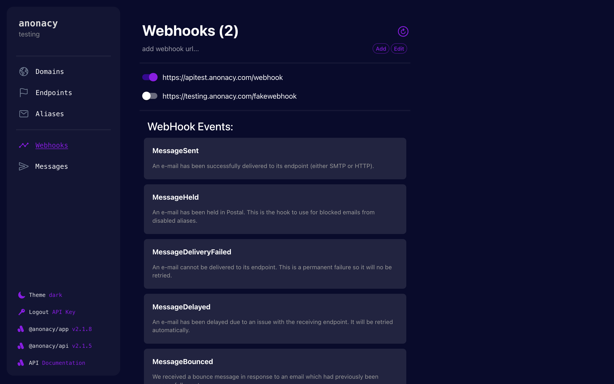

## @anonacy/app

***

## About
This app is for managing email alias identities with the v2 @anonacy/api. It allows you to view, edit, create, and delete aliases, domains, endpoints & more.

A commercial version hosted by us is found at [app.anonacy.com](https://app.anonacy.com)

## Installation

This app is provided as a [docker image](https://hub.docker.com/r/anonacy/app).
[@anonacy/api](https://github.com/anonacy/api) is a pre-requisite.

Please follow the api [installation guide](https://github.com/anonacy/api/blob/master/INSTALL.md), which includes installing this app.

## Authorization
As of now, the app uses simple api key authorization. It is available for organizations who need their own aliasing mail server. The api key is automatically scoped to the org & server it is assigned to.

User based authentication will come soon, enabling external users to manage aliases within a server. (Similar to v1 anonacy)

## Access
If you are an organization that would like to run their own aliasing server, please make a request to [support@anonacy.com](mailto:support@anonacy.com) and we can issue an api key depending on the use case.

## Features

- Domain Management & DNS Setup for mail forwarding

- Endpoint destination managment

- Aliases to forward mail anonymously (& light theme)

- Webhooks to be notified of email events & message delivery status (New!)

## Contributing

Contribution & development setup info can be found [here](./CONTRIBUTING.md)

***

Built by hew🪶