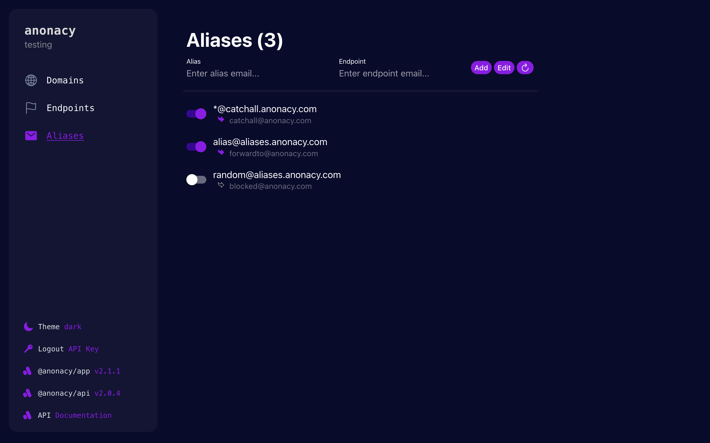
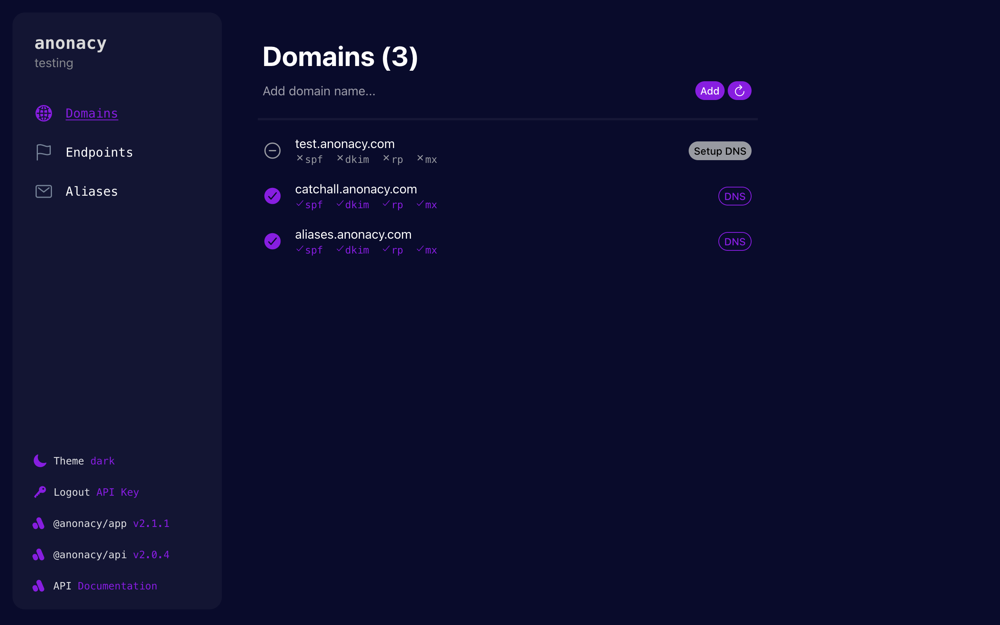
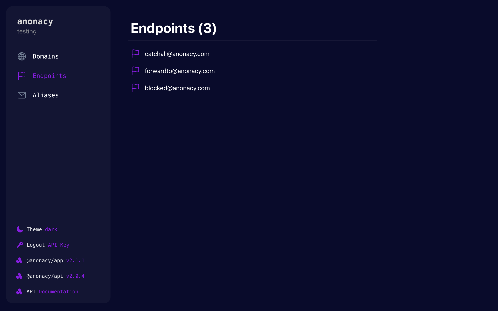
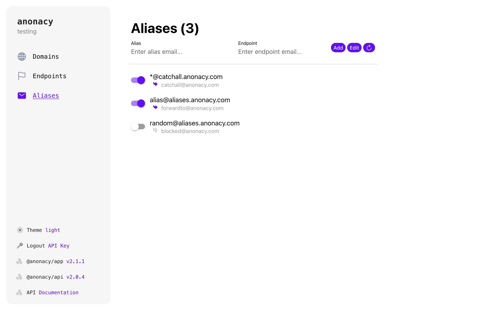

## @anonacy/app

***

### About
This app is for managing email alias identities with the v2 @anonacy/api. It allows you to view, edit, create, and delete aliases, domains, endpoints & more.



A commercial version hosted by us is found at [app.anonacy.com](https://app.anonacy.com)

### Authorization
As of now, the app uses simple api key authorization. It is available for organizations who need their own aliasing mail server. The api key is automatically scoped to the org & server it is assigned to.

User based authentication will come soon, enabling external users to manage aliases within a server. (Similar to v1 anonacy)

### Access
If you are an organization that would like to run their own aliasing server, please make a request to [support@anonacy.com](mailto:support@anonacy.com) and we can issue an api key depending on the use case.

### Documentation

This app is a lightweight UI for the @anonacy/api. Full api documentation can be found here:
https://api2.anonacy.com/docs/

### Features

Domain Management & DNS Setup for mail forwarding


Alias endpoint destination managment


Aliases to forward mail anonymously (& light theme)


***

### Technology
Built using [Vue 3](https://vuejs.org/) with the [Ionic Framework](https://ionicframework.com/)

### Development

To build the app, first clone the repo and `npm install`
```
git clone https://github.com/anonacy/app.git
cd app/
npm install
```
To run locally:
```
npm start
```

To build distribution:
```
npm run build
```

### Environment
Environment variables are handled by vite, details [here](https://vitejs.dev/guide/env-and-mode). 
Place dev variables in `.env.development` and prod variables in `.env.production`

| Variable | Info |
| -------- | -------- |
| `VITE_ENVIRONMENT`   | `production` or `development`   |
| `VITE_ANONACY_API_URL`   | `url` of `@anonacy/api` instance   |
| `VITE_TEST_API_KEY`   | `api key` to skip login **(dev only)**  |


***

Built by hew🪶